# Tutorial Framework Documentation

The purpose of this documentation is to provide additional details about the features of the Tutorial Framework.

## Editing narrative and instruction descriptions

You can add multiple paragraphs of text to the description fields of your tutorial page by adding line breaks between sections of text. IET parses this text and performs line wrapping per word by default, unless Chinese, Japanese or Korean characters are detected - in which case character-based wrapping is applied.

### Korean text

Due to "Han unification" - there is some overlap between Chinese, Japanese and Korean (later "CJK") characters / symbols. Korean uses spaces to distinguish between words and word wrapping is applied in a similar manner to English and most other languages.

For this purpose, we included a tag you can use to force word -based line wrapping. To force word-based wrapping, enclose the text with ```<wordwrap>```. After this, you should see wrapping occurring for each word instead of each character.

You can find more details below on how to use ```<wordwrap>```and other rich text tags.

### Using rich text in tutorial instructions and narratives

You can apply styling and add links to your tutorial content with rich text tags. Rich text tags are supported in the **Narrative Description** and **Instruction Description** -fields.

To use rich text, include some of the tags below on either of the **Description** fields mentioned above:

```
<b>Bold text here</b>
<i>Italic text here</i>
<a href="http://yourlink.com">Link text here</a>
<br/> Force a linebreak (not necessary, you can use return)
<wordwrap>Forced word wrap</wordwrap> Force word-based wrapping with CJK.
```

### Possible issues

If you forget to e.g. close tags or have any parsing issues in your text content, the tutorial will display a <style>error {color:red} </style><error>PARSE ERROR</error>. To fix this, edit the content and make sure you have no unclosed tags, wrong tags or improper tag nesting. Please refer to HTML 4.0 documentation for additional information on how to apply HTML tags.

## Tutorial media

You can choose to show image or video at the top of a tutorial page by choosing an appropriate **Header Media Type**. The specifications and recommended properties for the media are:
- tutorial page image/video: 300 x 150 (width x height)
- welcome dialog image: 700 x 200
- in your texture asset's Import Settings, make sure you have chosen **Editor GUI and Legacy GUI** as the **Texture Type**.
- for video, WebM VP8 is recommended ([read more](https://docs.unity3d.com/Manual/VideoSources-FileCompatibility.html))

## Masking 

We can mask and unmask any part of the Unity Editor to prevent unnecessary interactions. It's also a good way to teach users where certain actions take place.

For each tutorial page, there's an **Enable Masking** checkbox.

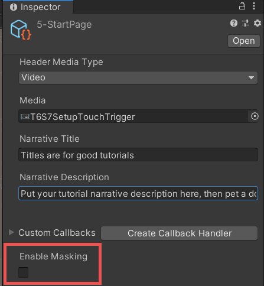

Tick the checkbox to enable the masking settings.  

This will immediately mask out the entire Editor except for the Tutorial window. You can't click or interact with anything that's masked. Fortunately, the authoring tools provide a masking preview toggle: click the **Preview Masking** button within the Tutorials window to either hide or preview the masking.: 

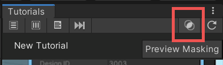

Now that you can interact with the rest of the Editor again, return to the newly enabled masking settings within the Tutorials window.  

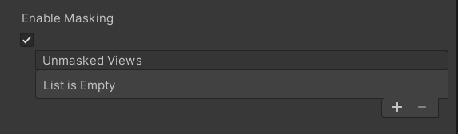

The **Add** (**+**) button lets you add multiple windows you'd like to unmask. 

Click the **Add** (**+**) button and change the **Selector Type** to **Editor Window.** This will let you select a window type from a list of options.

In the now available **Editor Window Type** select **ProjectBrowser.** This will add the Project window to the list of unmasked views. All windows within Unity can be found and accessed through this list. 

Note: the names of the options displayed are simplified by default. You can change this settings from **Edit** > **Preferences** > **In-Editor Tutorials**.

(If you click the Preview Masking button again now you will see that the Editor is masked except for the Project window)  

You can also set the **Mask Type** to change the functionality of the masking. By default, **Fully Unmasked** means the user can interact freely within this window. Any functionality within a Fully Unmasked window will be accessible to the user. On the other hand, **Block Interactions** will make the window easier to look at, but prevent a user from interacting with it. 

Keep in mind that you can unmask multiple windows in this way. The **Add** (**+**) button lets you add other Editor windows or GUI views. 

The **GUI View selector type** changes the options available in View Type. It allows you to mask out specific controls in the upper toolbar of the Editor, e.g., to mask out everything aside from the Play button.

To unmask everything but the Play button, set the Selector Type to GUI View. Set the View Type to UnityEditor.Toolbar (Note: if you turn off Preview Masking now, you'll see that the entire Unity toolbar is unmasked). We want to leave Mask Type as Fully Unmasked and leave Mask Size Modifier as it is.  

Next, add **Unmasked Controls**. This setting allows us to refine what to mask out within a specific window/Editor area. In this case, as we only want to unmask the Play button, we need to add an unmasked control to to UnityEditor.Toolbar setting. 

Change the **Selector Mode** to **Named Control**. The Play button is (as its name implies) a named control within the Unity Editor. The name for the Play button is: ToolbarPlayModePlayButton, which is exactly what needs to be entered into the **Control Name** field.  

Enable Preview Masking again to check that only the Play Button is unmasked now. 

The other common type of unmasking you might want to do is for a Property. Let's say you wanted to unmask the x, y and z positions of a Transform component. These are all properties within a transform component, so we set up our masking settings as follows: 

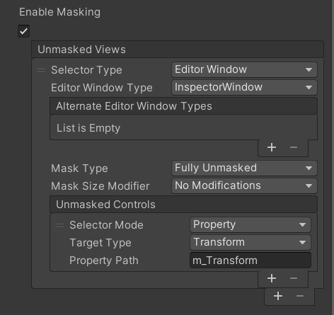

Note: this will work on whichever GameObject is currently active within the Inspector! It's best practice to make sure that a user has selected whichever GameObject's properties you want the user to modify within the same tutorial page, and to use masking accordingly to ensure no other object will be selected. 

## Future Prefabs and Criteria 

A good way to review many of the concepts within this guide is to create a "Future Prefab Instance". This is useful for tutorials that ask the user to spawn a prefab in the scene, and then modify values of said prefab within the scene. However, since the prefab doesn't exist in the scene until it's initialized, it requires some work, as follows.

First, let's create a new scene and a new Tutorial with at least two **Narrative with Instructions** tutorial pages, and the scene, attached to it: 

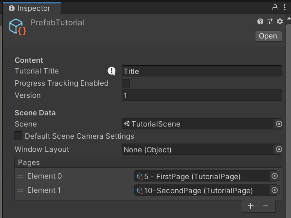

And assign it to the list of tutorials in the Tutorials file. For this tutorial, you can use any script with any property. This example features a simple Cube Prefab with a Prefab script attached. The script only contains a public int called magicNumber.

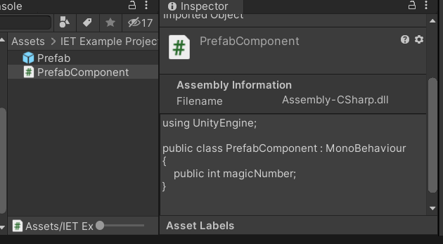

Make sure the prefab isn't currently spawned in the scene (you can have multiples of the same prefab, but this example is easier to explain using only one). Then, go to your first tutorial page and set it up similarly to this: 

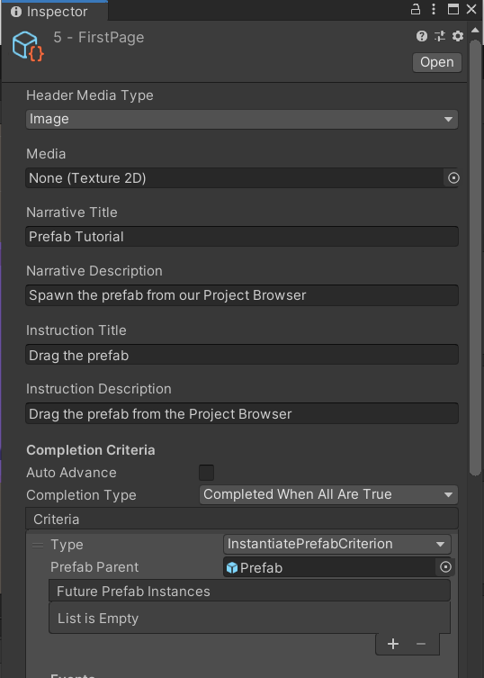

With the following masking settings:

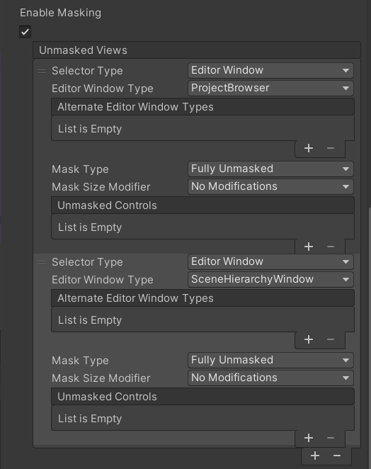

The criterion used is Unity.InteractiveTutorials.InstantiatePrefabCriterion. For the Prefab Parent, drag in the Prefab from the Project window. Click the **Add** (**+**) button next to "Future Prefab Instances: List is Empty" twice. This will create two new slots: None (Object) 

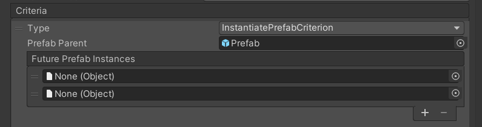

Now select the prefab from the Project window.
With the Prefab instance open in the Inspector, click on the lock in the upper right to lock the Inspector and make sure it won't change focus when you select another Asset or GameObject.

Open another Inspector window, and select the asset representing the first Tutorial Page.
From the Project window, drag the instantiated prefab into this first empty Future Prefab Instance slot.
Then drag the **PrefabComponent** script from the Inspector to the second one and save the scene.

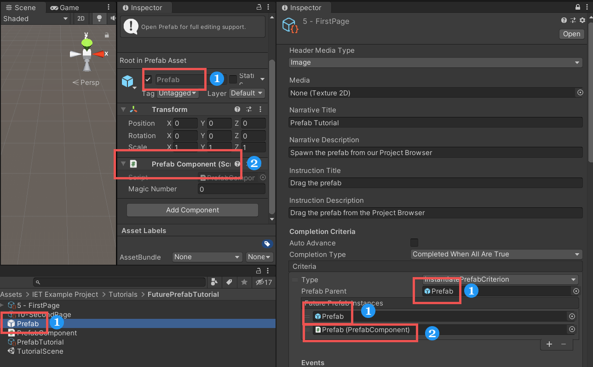

You should now see two new children object appear in the tutorial page in the Project window, the first one being the reference to the GameObject, the second being a reference to the Prefab script. 

The newly created children of the tutorial page are the Future Prefab Instance's references. The names depends on where they were created (Paragraph 1, Criterion 1, 1: Prefab (GameObject). Depending on which paragraph, how many criteria, or what the object is, these might change. Avoid changing the names, to ensure that they work correctly. You will need to use these object in the next tutorial page.  

In the 2nd tutorial page, let's add another instruction paragraph. We want the user to modify the magicNumber property on our prefab, so we'll add a PropertyModificationCriterion as criteria. Within this criteria are a couple of options we need to modify.  

Firstly, the **Property Path** is the name of the property. In the current prefab, it's named "magicNumber". If the property is derived from a different script, you can still access it: Otherscript.magicNumber for instance (Tip: If you're ever unsure what the property path is - for internal properties for instance - you can set your Editor to Debug mode and alt-left click on the name of the property).

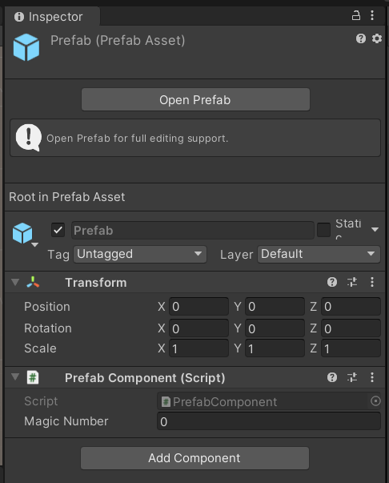

Next, the **Target Value Mode** can either be set to **Target Value** or to **Different Than Initial**. This setting is fairly self-explanatory - if you want a user to set a property to a specific value, enter the desired value in the **Target Value** property. If you just want the user to change a property without anything specific in mind, set it to **Different Than Initial** and you can ignore the Target Value property below. Remember to set a Target Value if you're using Target Value in Target Value Mode. 

In combination with that, you must set the **Target Value Type**. This denotes what type of property the user is changing. This has to be set correctly so make sure the type matches the property. In case of our magicNumber this would be an int, so set Target Value Type to integer.  

Lastly and most importantly is the **Target**, where a reference needs to be set. Try to drag the component reference created earlier to the Target: 

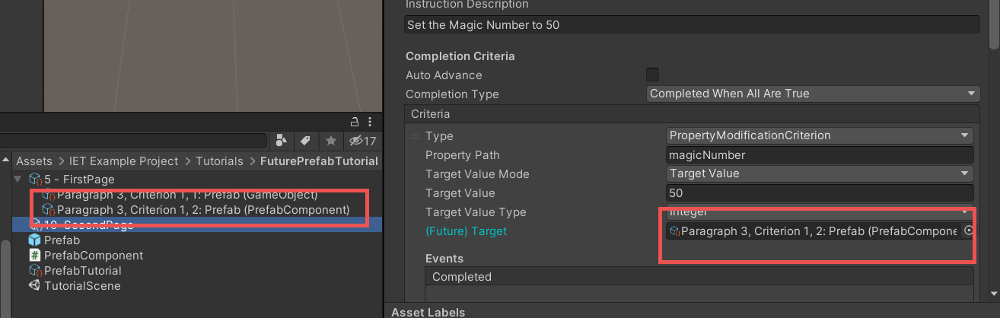

It is worth noting that for this type of Criteria, the IET Framework relies on assigning the component as target rather than the GameObject. If you simply assigned the GameObject, the system would not be able to detect changes on the **PrefabComponent** component.

You can now close the second Inspector window we opened and unlock the original Inspector on the right.  

Make sure your scene is saved. If you're running the tutorial, you can now click the "refresh" arrow in the upper right of the Tutorial window to restart the tutorial. This resets the tutorial progress, displays the first page, and reloads the scene.  

If you go through the tutorial now, you'll be able to set the magicNumber to 50 and see that this results in successful completion of the task.  

To finish, let's set up masking for this 2nd page so that it only lets the user edit the property. 

Enable Masking on the second Tutorial page. Set **Selector Type** to Editor Window, **Editor Window Type** to InspectorWindow, **Mask Type** to Fully Unmasked and **Mask Size Modifier** to No Modifications. We also need to add an "Unmasked Controls", so click the **Add** (**+**) button. 

Within the Unmasked Controls, set **Selector Mode** to Property. The next step is to correctly set up the **Target Type**.  

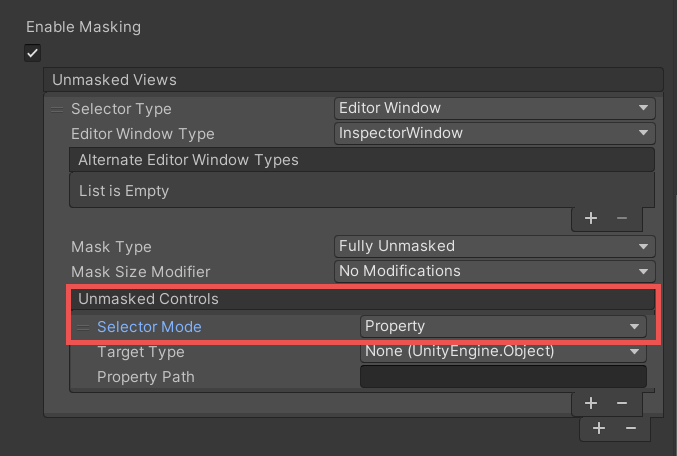

The Target Type within this Unmasked Controls lists every single script that exists within Unity and any packages in your project. Your custom-created scripts should be towards the top of this list, unless you have Cinemachine installed, in which case they'll be below those. Note that your scripts don't include any inheritance - so your PrefabScript will be listed as just that, as opposed to other scripts which are listed as UnityEngine.Something.  Select the PrefabScript from this list of Target Types. Lastly, set the **Property Path** to magicNumber.  

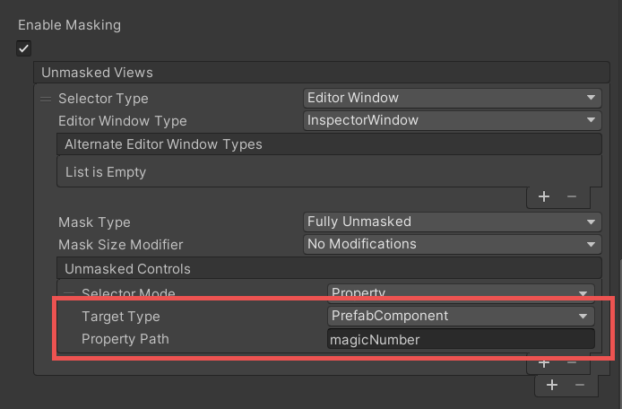

Restart the Tutorial - but make sure you don't save! Saving the scene would mean that the tutorial would start with a Prefab already existing in the Hierarchy and therefore in the scene.

You should be able to go through the tutorial now with everything masked correctly.  

Remember that it's a best practice to have these two instructions on the same page. Though we have masked everything out, there's always a chance something will go awry when instructions for selecting an object and modifying it are on two separate pages.   

## Criteria Descriptions 

Here's a list of all other criteria with brief descriptions of what they do.  

Remember to save the scene any time that you assign an object reference from the scene. This adds a hidden component ([SceneObjectGuid]) to the scene that holds the reference required for this framework to work correctly.

**ActiveToolCriterion** 

This criterion checks which tool the user currently has active - View, Move, Rotate, Scale, Rect, or Transform. You can use it to ensure that a user currently has the appropriate tool selected.

**ArbitraryCriterion** 

This is a special criterion which allows the tutorial author to specify any kind of logic by writing code in ScriptableObject or MonoBehaviour and assigning an instance of an object and a function that returns a boolean as a callback. It was added in 0.5.1.

**BuildStartedCriterion** 

This checks if the user has initiated a build.

**ComponentAddedCriterion** 

This criterion requires a user to add a specific component to a specific game object. You can assign a target game object normally, and pick a required component from a list of all available components (pre-existing in the engine, packages and custom ones) 

**EditorWindowCriterion** 

This criterion is useful for asking a user to open a specific window within the editor. You can select the window from the **Editor Window Type** list, and have the option to close the window if it's currently open thus forcing the user to open it themselves. 

**FrameSelectedCriterion** 

This ensures that the user Frame Selects a particular Game Object. This only requires an Object Reference.  

**InstantiatePrefabCriterion** 

As described above, you can check if a user has instantiated an object, and also create a Future Prefab Instance to use in other Tutorial Criteria. Future Prefab Instances can be created for components as well, so make sure you're creating the appropriate reference!

**MaterialPropertyModifiedCriterion** 

Assigns a Material in the Target Slot and sets Material Property Path to "_Color" to check whether a user has changed the color of a material.

**PlayModeStateCriterion** 

Checks which Play Mode the Editor is in. It can be toggled between Playing or Not Playing.

**PrefabInstanceCountCriterion** 

Checks how many prefabs exist within a scene. Can change **Comparison Mode** to decide how **Instance Count** works. You can set it to check if the amount of a certain prefab within a scene is at least "x" amount, exactly "x" amount or no more than "x" amount. The "x" amount is set in Instance Count and ranges between 0 and 100. 

<!-- Dev note: PreprocessBuildCriterion exists as a side effect of BuildStartedCriterion implementation but it's not meant to be used by the end user. -->

**PropertyModificationCriterion** 

Checks whether a Property within a GameObject has been modified. You need the exact property path (tip: putting the editor into Debug mode and alt-left clicking on a property name will give you the correct name).

Set the Target Value Mode to be either a Target Value or to be Different Than Initial. This lets you decide if you want the user to set the property to be a specific value or just something different than it was at the beginning.  

The Target Value field is where you enter the required target value, if necessary.  

Target Value Type has to be set appropriately (Integer, Decimal, Text, Boolean or Color) for this to work.

**RequiredSelectionCriterion** 

Checks to ensure the user has selected the correct GameObject/asset. This can be an object in the Hierarchy or an asset from the Project window. Especially helpful to appear ahead of ModifyProperty criteria, etc. 

**SceneAddedToBuildCriterion** 

This allows you to check whether a specific scene exists in the Project Build Settings. If the scene already exists in the Build Settings, the criteria will automatically be completed upon reaching it. Otherwise, the user has to drag the scene in as expected.

**SceneViewCameraMovedCriterion** 

Checks if the user has moved, zoomed or orbited around within the current scene view. 

<!-- Dev note: MockCriterion exists for the devs but it's not visible for the end user. -->

## Masking Settings 

**Editor window**

Within the Editor window, you can set which Editor window you'd like to reveal to the user. Set **Editor Window Type** to add that window to the unmasked views. For instance, the Hierarchy window is UnityEditor.SceneHierarchyWindow - selecting it would unmask it for the user. 

**Mask Type** dictates whether or not the window is fully unmasked and can be interacted with, or if it's revealed and highlighted for the user but not actually interactive.  

**GUI View** 

GUI View is used for specific view types within the Editor. You'll mostly want to use this to access the toolbar, where you can then access the buttons for the various tools and the play/pause/next frame buttons.

**Unmasked Controls**

**GUI Content**

GUI Content allows you to enter a text, tooltip text, or image via reference. GUI Content with matching properties will not be masked in the Editor.

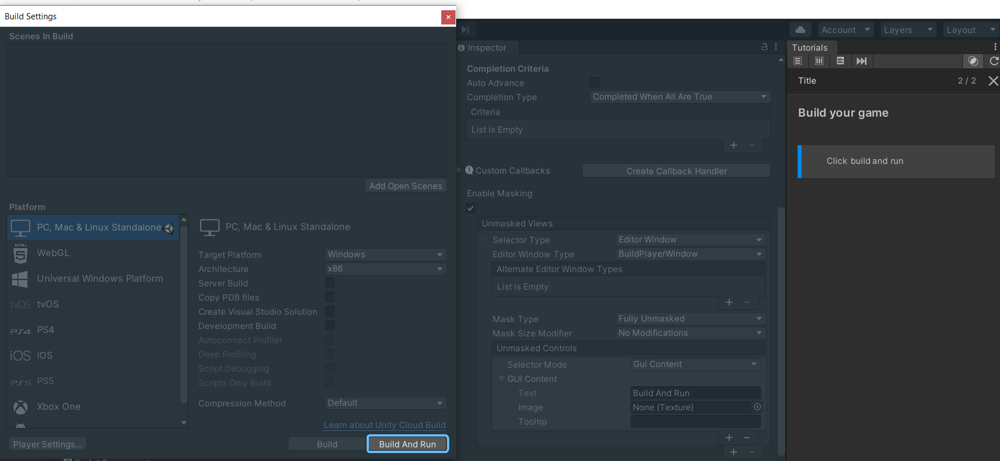

For example, in the above screenshot, "Build And Run" is entered in the "Text" property of the Unmasked Controls and everything aside from that button is masked out. This is contextual depending on which Editor window you have selected. You could use this to unmask specific Assets within the Project window or GameObjects within the Hierarchy.

**Named Control** 

Named Control is used for specifically named controls within the Unity Editor. For example, the tools used to navigate the scene have the following Named Controls:
- "ToolbarPersistentToolsPan" for the Pan tool,
- "ToolbarPersistentToolsTranslate" for the Move tool,
- "ToolbarPersistentToolsRotate" for the Rotate tool,
- "ToolbarPersistentToolsScale" for the Scale tool,
- "ToolbarPersistentToolsRect" for the Rect tool, and
- "ToolbarPersistentToolsTransform" for the General Transform tool.

Another important Named Control is the Play Button, "ToolbarPlayModePlayButton".

**GUI Style Name** 

GUI Content allows you to enter a [name of a GUIStyle](https://docs.unity3d.com/ScriptReference/GUIStyle-name.html).
GUI elements drawn with the style of this name will not be masked.

**Object Reference** 

Allows you to specify a GUI element for a specific Unity object, a scene object or an asset, which will not be unmasked.
Note that for assets, currently the asset's name must be very short in order for the unmasking to work; if the name is not short
and appears in a shortened form (ends with ellipsis), the unmasking doesn't work.

**Property** 

This is any property existing within the Unity Editor or custom-created within a script. Remember that you can obtain property names by changing the Editor into debug mode, and alt / option + left-clicking on a property name to show its declaration name.

## Tutorial Styles

The Tutorial Styles asset can be created within the Project window by right-clicking and going to **Create** > **Tutorials** > **Tutorial Styles**. This asset allows you to modify everything visual about the walkthrough:

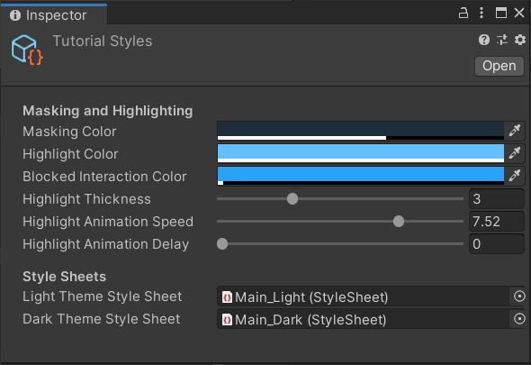

In order for any of these changes to take effect, this asset must be assigned within the Tutorial Project Settings asset. 

### Tutorial Style Sheets

Tutorial Style Sheets can be used to fully customize the style of the Tutorials window. Use **Create** > **Tutorials** > **Light Tutorial Style Sheet** and **Dark Tutorial Style Sheet** to create style sheets for customization and assign the style sheets as Light/Dark Theme Style Sheet of your Tutorial Styles. The dark/light theme is applied according to the user's Editor Theme preference.

## Tutorial Project Settings

Tutorial Project Settings is another asset that you can create within the Project window, by right-clicking and going to **Create** > **Tutorials** > **Tutorial Project Settings**. The settings in this asset are automatically applied to the entire project as soon as this asset is created.

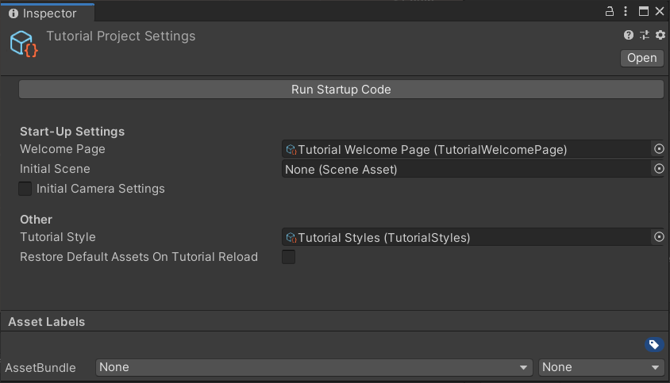

The settings allow you to modify the following:

**Welcome Page**

If set, this page is shown in the welcome dialog when the project is started for the first time.

**Initial Scene**

If set, this scene will be loaded when the project is started for the first time.

**Initial Camera Settings**

If enabled, allows for tweaking of the position/rotation of the camera of the Initial Scene

**Restore Default Assets On Tutorial Reload** 

When enabled, everything in Assets is copied into Tutorial Defaults, and upon the Tutorial being finished, it's copied back into Assets. This means that every asset will be reset upon the restart of the tutorial, and that the size of your project will double. With this option disabled, changes to assets will remain. If your project has lot of large assets or includes several tutorials that build upon each other, you should have this option disabled to prevent errors!

**Tutorial Style**

This is where you assign your Tutorial Styles asset. This changes the visuals of your tutorials (see section above).

## Tips

To trigger the tutorial project initialization code, you can delete the `InitCodeMarker` file in the project's root and reopen the project. Also, you can create a folder in `Assets/DontRunInitCodeMarker` to prevent the initialization code from being run, if necessary.

[SceneObjectGuid]: https://docs.unity3d.com/Packages/com.unity.learn.iet-framework@2.0/api/Unity.Tutorials.Core.SceneObjectGuid.html